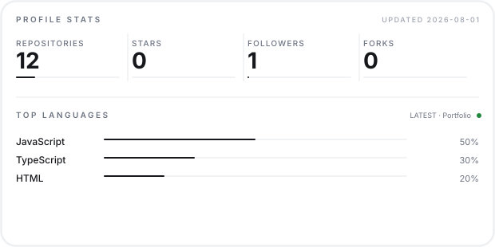
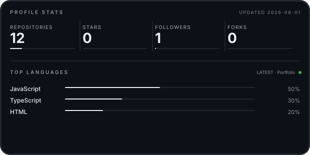

Open to collaborations

Radheshyam Bhati

Full-Stack Developer&nbsp;&nbsp;·&nbsp;&nbsp;AI Integration&nbsp;&nbsp;·&nbsp;&nbsp;Real-Time Systems

  <a href="https://linkedin.com/in/radheshyam-bhati" style="display:inline-block; padding:9px 20px; border-radius:999px; background-color:var(--bgColor-muted, #F6F8FA); border:1px solid var(--borderColor-default, #D1D9E0); color:var(--fgColor-default, #1F2328); font-size:13px; font-weight:600; text-decoration:none; margin:3px 4px;">LinkedIn</a>
  <a href="mailto:radheshyambhati747@gmail.com" style="display:inline-block; padding:9px 20px; border-radius:999px; background-color:var(--bgColor-muted, #F6F8FA); border:1px solid var(--borderColor-default, #D1D9E0); color:var(--fgColor-default, #1F2328); font-size:13px; font-weight:600; text-decoration:none; margin:3px 4px;">Email</a>
  <a href="https://radheshyam-cod.github.io/Portfolio" style="display:inline-block; padding:9px 20px; border-radius:999px; background-color:var(--bgColor-muted, #F6F8FA); border:1px solid var(--borderColor-default, #D1D9E0); color:var(--fgColor-default, #1F2328); font-size:13px; font-weight:600; text-decoration:none; margin:3px 4px;">Portfolio</a>
  <a href="https://github.com/radheshyam-bhati" style="display:inline-block; padding:9px 20px; border-radius:999px; background-color:var(--bgColor-muted, #F6F8FA); border:1px solid var(--borderColor-default, #D1D9E0); color:var(--fgColor-default, #1F2328); font-size:13px; font-weight:600; text-decoration:none; margin:3px 4px;">GitHub</a>

  
  

<!-- Self-hosted github-readme-stats card (theme-aware). -->

  
  

<!-- Contribution activity graph (theme-aware). -->

  
  

 

01 · About

<h2 style="font-size:26px; font-weight:800; letter-spacing:-0.5px; margin:0 0 14px; color:var(--fgColor-default, #1F2328);">About</h2>

I care about clean architecture, modular code, and products that actually solve problems. My work spans monorepo full-stack apps, AI-powered document processing, and real-time voice systems — always with an eye on what runs well in production, not just what demos well.

 

02 · Now

<h2 style="font-size:26px; font-weight:800; letter-spacing:-0.5px; margin:0 0 14px; color:var(--fgColor-default, #1F2328);">Currently building &amp; learning</h2>

Building
Multi-agent AI orchestration · real-time collaboration (WebRTC / WebSockets) · open-source tooling

Learning
AI agents · WebRTC &amp; CRDT collaboration patterns · monorepo architecture

Education
B.Tech Computer Science &amp; Engineering — PW Institute of Innovation · Class of 2029 · Jodhpur · Pune, India

 

03 · Stack

<h2 style="font-size:26px; font-weight:800; letter-spacing:-0.5px; margin:0 0 14px; color:var(--fgColor-default, #1F2328);">What I work with</h2>

Languages

PythonJavaScriptTypeScriptCC++

Frontend

ReactNext.jsViteTailwind CSSFramer MotionGSAP

Backend

Node.jsNestJSFastAPIExpress

Data

PostgreSQLMySQLRedisFirebasePrismaIndexedDB

AI

OpenAIGoogle GeminiGoogle Document AIMem0

Realtime

WebRTCSocket.IO

Tooling

TurborepopnpmDockerGitVercelNetlifyGitHub Pages

 

04 · Projects

<h2 style="font-size:26px; font-weight:800; letter-spacing:-0.5px; margin:0 0 14px; color:var(--fgColor-default, #1F2328);">Selected work</h2>

01
MedConnect

AI-powered unified health records for India — prescriptions, lab reports, imaging, with two-engine OCR.

Next.js 15NestJSPrismaPostgreSQLRedisGemini
<a href="https://github.com/radheshyam-bhati/medconnect" style="display:inline-block; padding:7px 7px 7px 16px; border-radius:999px; background-color:var(--fgColor-default, #1F2328); color:var(--bgColor-default, #FFFFFF); font-size:12px; font-weight:600; text-decoration:none;">Repo ↗</a>

02
MafiaAttack

Social deduction game with phase-aware WebRTC voice, zero media servers.

Node.jsSocket.IOWebRTC
<a href="https://github.com/radheshyam-bhati/MafiaAttack" style="display:inline-block; padding:7px 7px 7px 16px; border-radius:999px; background-color:var(--fgColor-default, #1F2328); color:var(--bgColor-default, #FFFFFF); font-size:12px; font-weight:600; text-decoration:none;">Repo ↗</a>

03
GitHub Explorer

Search + analytics for any GitHub profile, 12-module zero-dependency frontend.

Vanilla JSChart.js
<a href="https://github.com/radheshyam-bhati/GitHub-Developer-Explorer" style="display:inline-block; padding:7px 7px 7px 16px; border-radius:999px; background-color:var(--fgColor-default, #1F2328); color:var(--bgColor-default, #FFFFFF); font-size:12px; font-weight:600; text-decoration:none;">Repo ↗</a>

04
News Feed

Real-time news ticker with debounced search and batch rendering.

Vanilla JSNewsAPI
<a href="https://github.com/radheshyam-bhati/News-Feed" style="display:inline-block; padding:7px 7px 7px 16px; border-radius:999px; background-color:var(--fgColor-default, #1F2328); color:var(--bgColor-default, #FFFFFF); font-size:12px; font-weight:600; text-decoration:none;">Repo ↗</a>

05
Story

Interactive museum of internet history — scroll-driven narrative, canvas particles.

React 18TypeScriptFramer Motion
<a href="https://github.com/radheshyam-bhati/Story" style="display:inline-block; padding:7px 7px 7px 16px; border-radius:999px; background-color:var(--fgColor-default, #1F2328); color:var(--bgColor-default, #FFFFFF); font-size:12px; font-weight:600; text-decoration:none;">Repo ↗</a>

06
Online Voting

Client-side EVM + VVPAT simulation, one-vote-per-voter, zero servers.

Vanilla JSIndexedDBChart.js
<a href="https://github.com/radheshyam-bhati/Online-Voting-system" style="display:inline-block; padding:7px 7px 7px 16px; border-radius:999px; background-color:var(--fgColor-default, #1F2328); color:var(--bgColor-default, #FFFFFF); font-size:12px; font-weight:600; text-decoration:none;">Repo ↗</a>

07
IntelliDine

Real-time restaurant management platform for front-of-house, kitchen, and management teams.

Next.js 14ExpressSocket.IOPrismaFastAPI
<a href="https://github.com/radheshyam-bhati/IntelliDine" style="display:inline-block; padding:7px 7px 7px 16px; border-radius:999px; background-color:var(--fgColor-default, #1F2328); color:var(--bgColor-default, #FFFFFF); font-size:12px; font-weight:600; text-decoration:none;">Repo ↗</a> <a href="https://intelli-dine-web.vercel.app/login" style="display:inline-block; padding:7px 7px 7px 16px; border-radius:999px; background-color:var(--fgColor-default, #1F2328); color:var(--bgColor-default, #FFFFFF); font-size:12px; font-weight:600; text-decoration:none;">Live ↗</a>

08
Portfolio

Motion-rich personal portfolio, three animation rewrites deep.

React 19ViteFramer Motion
<a href="https://radheshyam-cod.github.io/Portfolio" style="display:inline-block; padding:7px 7px 7px 16px; border-radius:999px; background-color:var(--fgColor-default, #1F2328); color:var(--bgColor-default, #FFFFFF); font-size:12px; font-weight:600; text-decoration:none;">Live ↗</a>

 

05 · Recognition

<h2 style="font-size:26px; font-weight:800; letter-spacing:-0.5px; margin:0 0 14px; color:var(--fgColor-default, #1F2328);">Hackathons &amp; awards</h2>

01
Yophoria 2025

3rd Runner Up, AI Innovation — university teams across India.

02
Mumbai Hacks 2025

24-hour hackathon · Fin-Mate, AI personal finance coach.

03
HackXios 2K25

AWS-backed hackathon · cross-functional team delivery.

 

06 · Play

<h2 style="font-size:26px; font-weight:800; letter-spacing:-0.5px; margin:0 0 14px; color:var(--fgColor-default, #1F2328);">Interactive demo</h2>

<a href="https://radheshyam-bhati.github.io/radheshyam-bhati/game/" style="display:inline-block; padding:14px 14px 14px 26px; border-radius:999px; background-color:var(--fgColor-default, #1F2328); color:var(--bgColor-default, #FFFFFF); font-size:14px; font-weight:700; text-decoration:none;">Switchboard Training Simulation ↗</a>

Patch cables between projects to explore how they connect.

 

07 · Contact

<h2 style="font-size:26px; font-weight:800; letter-spacing:-0.5px; margin:0 0 14px; color:var(--fgColor-default, #1F2328);">Find me around the web</h2>

  <a href="mailto:radheshyambhati747@gmail.com" style="display:inline-block; padding:9px 20px; border-radius:999px; background-color:var(--bgColor-muted, #F6F8FA); border:1px solid var(--borderColor-default, #D1D9E0); color:var(--fgColor-default, #1F2328); font-size:13px; font-weight:600; text-decoration:none; margin:3px 4px;">Email</a>
  <a href="https://linkedin.com/in/radheshyam-bhati" style="display:inline-block; padding:9px 20px; border-radius:999px; background-color:var(--bgColor-muted, #F6F8FA); border:1px solid var(--borderColor-default, #D1D9E0); color:var(--fgColor-default, #1F2328); font-size:13px; font-weight:600; text-decoration:none; margin:3px 4px;">LinkedIn</a>
  <a href="https://github.com/radheshyam-bhati" style="display:inline-block; padding:9px 20px; border-radius:999px; background-color:var(--bgColor-muted, #F6F8FA); border:1px solid var(--borderColor-default, #D1D9E0); color:var(--fgColor-default, #1F2328); font-size:13px; font-weight:600; text-decoration:none; margin:3px 4px;">GitHub</a>
  <a href="https://radheshyam-cod.github.io/Portfolio" style="display:inline-block; padding:9px 20px; border-radius:999px; background-color:var(--bgColor-muted, #F6F8FA); border:1px solid var(--borderColor-default, #D1D9E0); color:var(--fgColor-default, #1F2328); font-size:13px; font-weight:600; text-decoration:none; margin:3px 4px;">Portfolio</a>

📍 Jodhpur · Pune, India — open to collaborations, hackathons, and interesting problems.

Last updated July 2026

