Radheshyam Bhati

Full-Stack Developer&nbsp;&nbsp;·&nbsp;&nbsp;AI Integration&nbsp;&nbsp;·&nbsp;&nbsp;Real-Time Systems

  <a href="https://linkedin.com/in/radheshyam-bhati" style="display:inline-block; padding:9px 20px; border-radius:999px; background-color:var(--bgColor-muted, #F6F8FA); border:1px solid var(--borderColor-default, #D1D9E0); color:var(--fgColor-default, #1F2328); font-size:13px; font-weight:600; text-decoration:none; margin:3px 4px;">LinkedIn</a>
  <a href="mailto:radheshyambhati747@gmail.com" style="display:inline-block; padding:9px 20px; border-radius:999px; background-color:var(--bgColor-muted, #F6F8FA); border:1px solid var(--borderColor-default, #D1D9E0); color:var(--fgColor-default, #1F2328); font-size:13px; font-weight:600; text-decoration:none; margin:3px 4px;">Email</a>
  <a href="https://radheshyam-cod.github.io/Portfolio" style="display:inline-block; padding:9px 20px; border-radius:999px; background-color:var(--bgColor-muted, #F6F8FA); border:1px solid var(--borderColor-default, #D1D9E0); color:var(--fgColor-default, #1F2328); font-size:13px; font-weight:600; text-decoration:none; margin:3px 4px;">Portfolio</a>
  <a href="https://github.com/radheshyam-bhati" style="display:inline-block; padding:9px 20px; border-radius:999px; background-color:var(--bgColor-muted, #F6F8FA); border:1px solid var(--borderColor-default, #D1D9E0); color:var(--fgColor-default, #1F2328); font-size:13px; font-weight:600; text-decoration:none; margin:3px 4px;">GitHub</a>
  <a href="https://radheshyam-bhati.github.io/radheshyam-bhati/game/" style="display:inline-block; padding:9px 20px; border-radius:999px; background-color:var(--fgColor-default, #1F2328); color:var(--bgColor-default, #FFFFFF); font-size:13px; font-weight:600; text-decoration:none; margin:3px 4px;">Play the game ↗</a>

<!-- Animated status line (theme-aware, CSS animations run inside the SVG). -->

  
  

 

  I build full-stack apps, AI pipelines, and real-time systems — the kind that keep working in production, not just at the demo.

 

<!-- Contribution activity graph (theme-aware). -->

  
  

📍 Jodhpur · Pune, India — open to collaborations, hackathons, and interesting problems.

Last updated July 2026

